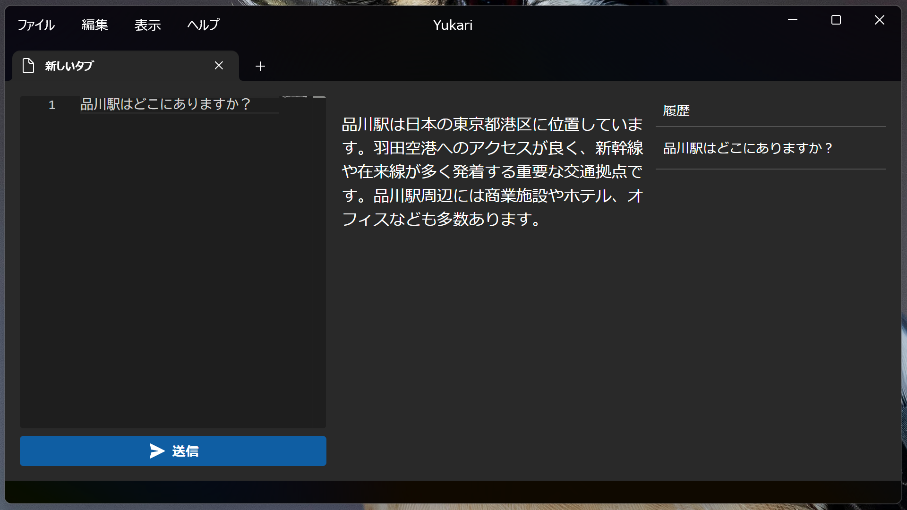

# Yukari
日本語 | [English](README.en.md)

Yukari is a desktop application for generative AI clients.
It is a WinUI 3 application compatible with Windows 10 / 11.

## Download

- [Yukari](https://github.com/Himeyama/yukari/releases) (*required)
- [WebView2](https://developer.microsoft.com/en-us/microsoft-edge/webview2#download) (If the WebView2 runtime is not installed, install the x64 Evergreen Standalone Installer)
- [Visual C++ Redistributable](https://www.microsoft.com/en-us/download/details.aspx?id=48145) (if you get an error stating that vcruntime140.dll is missing)

Yukari is a combination of the following three projects:
- yukari
- [yukari-ui](https://github.com/himeyama/yukari-ui)
- [yukari-engine](https://github.com/himeyama/yukari-engine)

## yukari
- Desktop application using WinUI 3
- The main application that users interact with

## [yukari-ui](https://github.com/himeyama/yukari-ui)
- A React application that consists of the UI components of the desktop application
- Provides the user interface and is integrated into Yukari

## [yukari-engine](https://github.com/himeyama/yukari-engine)
- Provides functionality for a Web API server
- Responsible for managing the OpenAI API key
- Handles requests from the desktop application (Yukari)