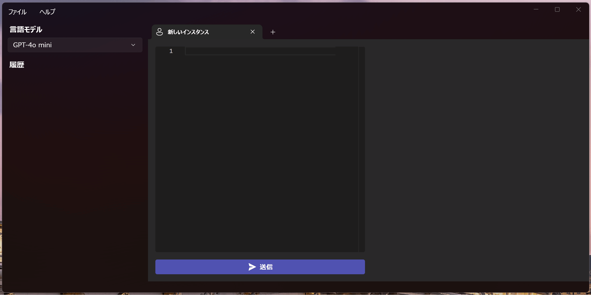

# Yukari
日本語 | [English](README.en.md)

Yukari は生成 AI クライアントのデスクトップアプリです。
Windows 10 / 11 対応の WinUI 3 アプリです。

## ダウンロード

- [Yukari](https://github.com/Himeyama/yukari/releases) (*必須)
- [WebView2](https://developer.microsoft.com/ja-jp/microsoft-edge/webview2#download) (WebView2 ランタイムがインストールされていない場合、エバーグリーンスタンドアロンインストーラーの x64 をインストール)
- [Visual C++ 再頒布可能パッケージ](https://www.microsoft.com/ja-jp/download/details.aspx?id=48145) (vcruntime140.dll 見つからないエラーが出る場合)

Yukari は以下の 3 つのプロジェクトの組み合わせでできています。
- yukari
- [yukari-ui](https://github.com/himeyama/yukari-ui)
- [yukari-engine](https://github.com/himeyama/yukari-engine)

## yukari
- WinUI 3 を使用したデスクトップアプリ
- ユーザーが操作するメインアプリケーション

## [yukari-ui](https://github.com/himeyama/yukari-ui)
- デスクトップアプリの UI コンポーネントを構成する React アプリ
- ユーザーインターフェースを提供し、yukari に統合されている

## [yukari-engine](https://github.com/himeyama/yukari-engine)
- Web API サーバーの機能を提供
- OpenAI の API キーを管理する役割
- デスクトップアプリ (yukari) からのリクエストを処理
